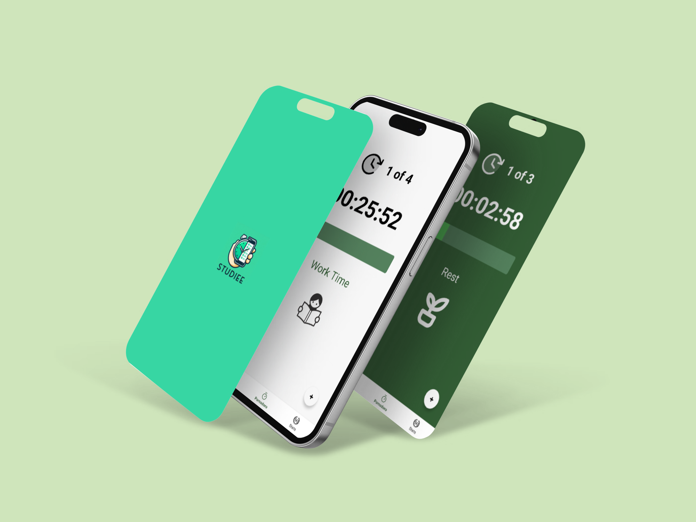
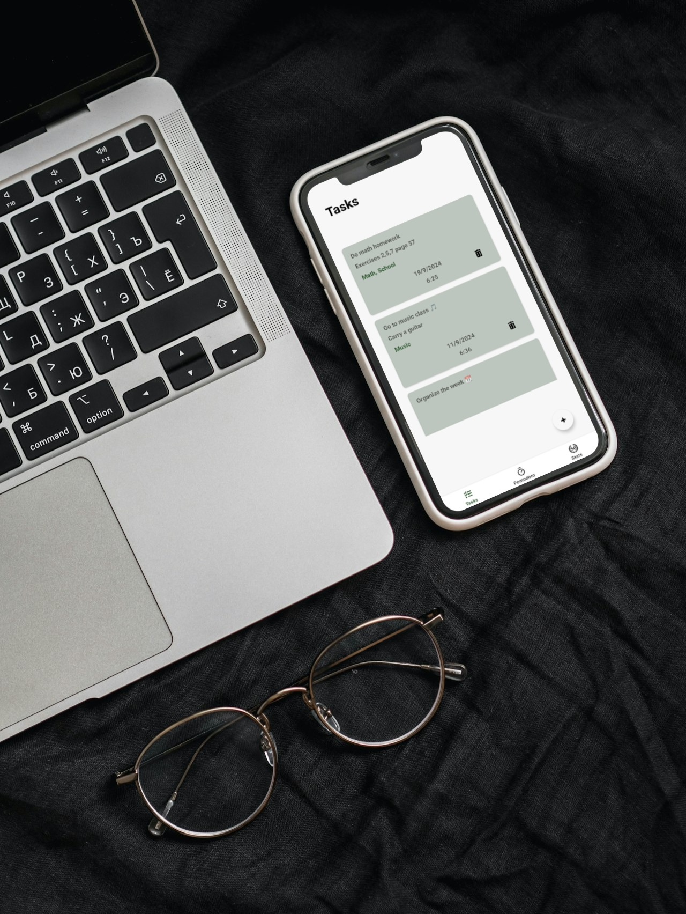
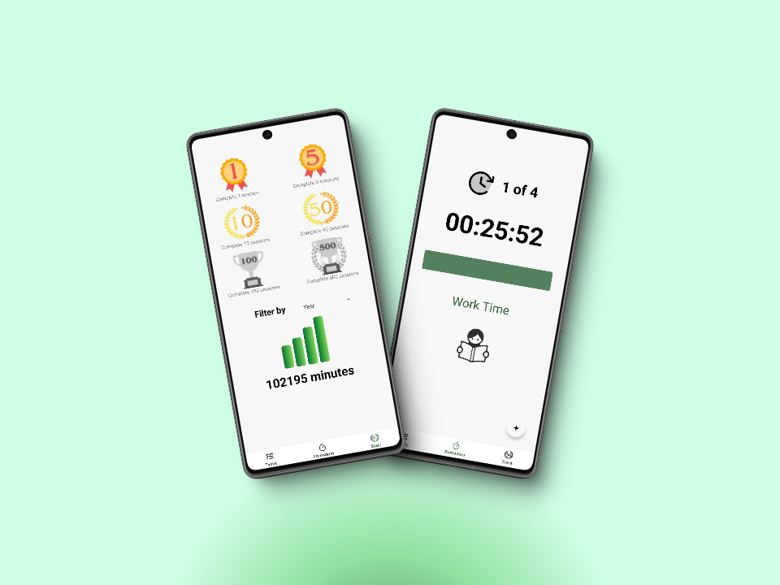
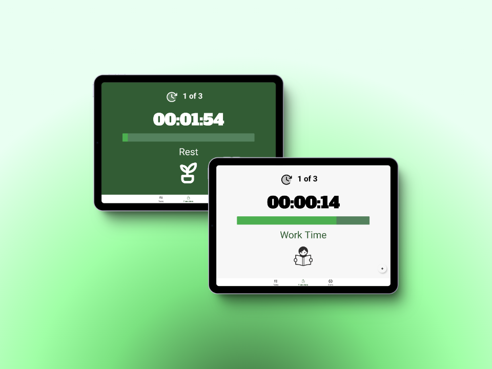

<h1 align="center">Hey there, I'm Diego!👋 </h1>

  
<h2>About Me:</h2>

  <ul>
    <li>🌱 I'm currently studying <strong>Multiplatform Application Development</strong>.</li>
    <li>📚 I'm learning <strong>Android</strong>, <strong>Kotlin</strong>, <strong>Java</strong>, <strong>SQL</strong>,  JavaFx, markup languages, and more...</li>
    <li>💡 I am focused on working on projects to improve my skill level. </li>
    <li>💬 Feel free to message me.</li>
  </ul>

## 🛠️ Skills

  
  
  
  
  
  
  

 # 🚀 Latest Project: Studiee

  <section align="center">
    <table>
      <tr>
        <td></td>
        <td>Snapshot of the <strong>Pomodoro feature</strong> in my app, which helps users manage their time effectively.</td>
      </tr>
      <tr>
        <td></td>
        <td>Here’s a view of the <strong>task list</strong> that allows users to stay organized and focused.</td>
      </tr>
      <tr>
        <td></td>
        <td>This section showcases the <strong>trophy system</strong> that motivates users to reach their productivity goals while also monitoring their effort.</td>
      </tr>
      <tr>
        <td></td>
        <td>Studiee <strong>fully compatible with tablets</strong>, providing a seamless experience on larger screens.</td>
      </tr>
    </table>

   DOWNLOAD COMING SOON... 🕙🕙
  </section>

  
☎️ <h2>Contact Me</h2>

  <samp>
    

      
      
    

  </samp>

