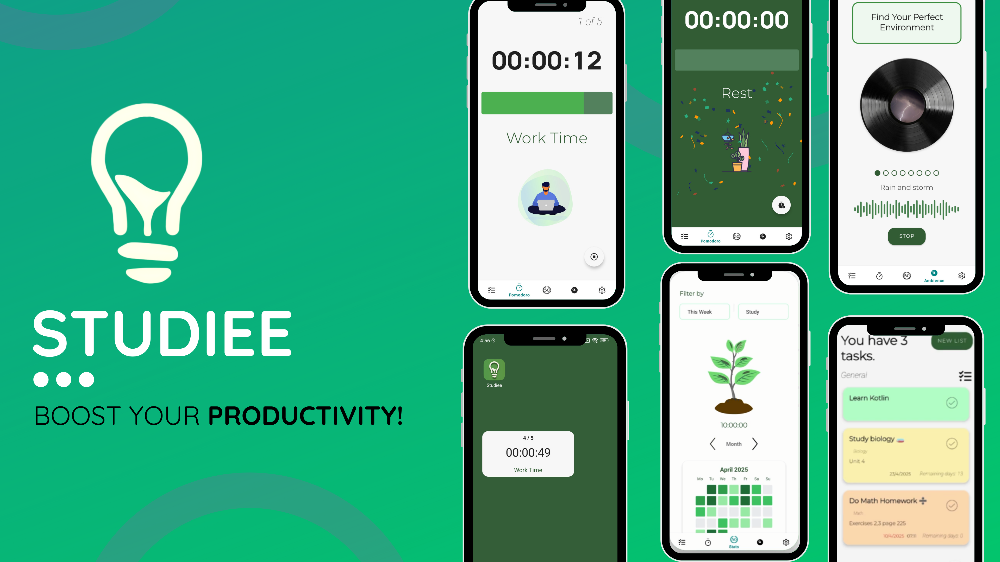

<h1 align="center">Hey there, I'm Diego!👋 </h1>

  
<h2>About Me:</h2>

  <ul>
    <li>🌱 I'm currently studying <strong>Multiplatform Application Development</strong>.</li>
    <li>📚 I'm learning <strong>Android</strong>, <strong>Kotlin</strong>, <strong>Java</strong>, <strong>SQL</strong>,  JavaFx, markup languages, and more...</li>
    <li>💡 I am focused on working on projects to improve my skill level. </li>
    <li>💬 Feel free to message me.</li>
  </ul>

## 🛠️ Skills

  
  
  
  
  
  
  
  
  

 # 🚀 Latest Project: Studiee
### 🎉 DOWNLOAD FOR FREE (NO ADS) 👉 [**bit.ly/StudieeApp**](https://bit.ly/StudieeApp)
### 🎥 DEMO VIDEO [Watch here](https://youtu.be/AmpMHr1Wj0I)
<section align="center">
  <table>
    <tr>
      <td></td>
    </tr>
    <tr>
    <td>Android productivity app with task management, Pomodoro timer, countdown, and ambient sounds to enhance focus.</td>
    </tr>
  </table>
</section>

  
☎️ <h2>Contact Me</h2>

  <samp>
    

      
      
    

  </samp>

